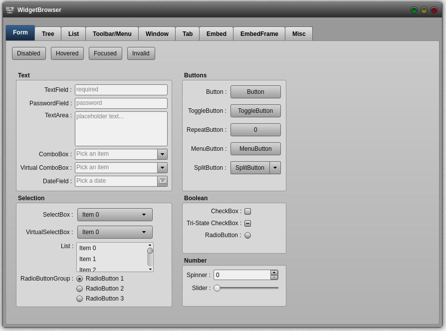

<!-- PROJECT LOGO -->
<br />
<p align="center">
  <a href="https://github.com/goldim/SilverBlueTheme">
    
  </a>

  <h3 align="center"></h3>

  <p align="center">
    A theme for the Qooxdoo JavaScript Framework
  </p>
</p>

<!-- ABOUT THE PROJECT -->
## About The Project

The «GraydientTheme» mainly relies on CSS techniques in order to create the appearances of widgets. 
This makes it rather lightweight and the rendering of GUI elements shows almost no delays.

In the current version of «Graydient» a lot of items have changed compared to the earlier version of 2011. 
Some people might even say that it's not the same theme anymore. Nevertheless, I hope a few people like it 
and consider using it in one of their applications.

**Form Controls**


<!-- GETTING STARTED -->
## Using the Theme in your Application
To use the Theme in your application, go into the application root directory and install the theme into your project:
```sh
$ qx package update
$ qx package list
$ qx package install goldim/GraydientTheme
```
now you just have to modify your compile.json to enable the theme:
```sh
"applications": [
  {
    ...
    "theme": "graydienttheme.theme.Theme",
    ...
  }
],
```

<!-- DEMOS -->
## Demo
Using Qooxdoos [WidgetBrowser](http://qooxdoo.org/qxl.packagebrowser/qxl.packagebrowser/demos/goldim/GraydientTheme/widgetbrowser/)

<!-- ROADMAP -->
## Roadmap

TBD


<!-- LICENSE -->
## License

Distributed under the MIT License. See `LICENSE` for more information.


<!-- CONTACT -->
## Contact

Norbert Schröder - [@scro34](http://scro34.de/) - email: n.schroeder@scro34.de
